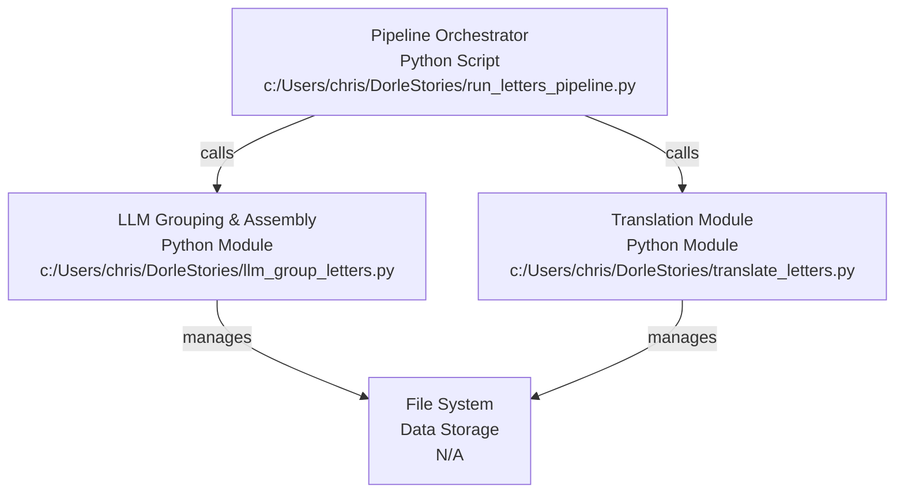

# Codebase Research Report

## Query
can you explain the main pipleine of this code through the existing wrapper script? 

## Answer
# Codebase Pipeline Report

## High-Level Architecture

The codebase implements a pipeline for processing scanned German letters, involving Optical Character Recognition (OCR), LLM-driven grouping of pages into letters, and subsequent translation into English. The entire workflow is orchestrated by a central wrapper script, [run_letters_pipeline.py](c:/Users/chris/DorleStories/run_letters_pipeline.py), which sequentially executes two main components: the **LLM Grouping and Assembly** module and the **Translation** module.

### Main Pipeline Orchestrator: [run_letters_pipeline.py](c:/Users/chris/DorleStories/run_letters_pipeline.py)

This script serves as the entry point for the entire letter processing pipeline. It handles argument parsing, environment setup (loading `.env` for API keys), and sequentially calls the core processing scripts.

*   **Purpose**: To provide a unified command-line interface for running the complete workflow from OCR to English translation.
*   **Internal Parts**:
    *   `main()` function: Coordinates the execution of the two main steps.
    *   `run()` function: A helper to execute shell commands using `subprocess.run`.
*   **External Relationships**:
    *   Calls [llm_group_letters.py](c:/Users/chris/DorleStories/llm_group_letters.py) for the first stage of processing.
    *   Calls [translate_letters.py](c:/Users/chris/DorleStories/translate_letters.py) for the second stage of processing.
    *   Interacts with the file system to manage input image directories, intermediate German OCR output, and final letter directories.

## Mid-Level Pipeline Stages

```mermaid
graph TB
  subgraph Stage1["Stage 1: LLM Grouping and Assembly"]
    llmGroupLetters["llm_group_letters.py<br>Python Script<br>c:/Users/chris/DorleStories/llm_group_letters.py"]
    extractGermanText["extract_german_text()<br>Function<br>c:/Users/chris/DorleStories/llm_group_letters.py:100"]
    listGermanPages["list_german_pages()<br>Function<br>c:/Users/chris/DorleStories/llm_group_letters.py:20"]
    buildInputListing["build_input_listing()<br>Function<br>c:/Users/chris/DorleStories/llm_group_letters.py:80"]
    callLlmGrouping["call_llm_grouping()<br>Function<br>c:/Users/chris/DorleStories/llm_group_letters.py:125"]
    assembleLetters["assemble_letters()<br>Function<br>c:/Users/chris/DorleStories/llm_group_letters.py:150"]
    geminiApi1["Google Gemini API<br>External Service<br>N/A"]
    imageFiles["Image Files<br>Input Data<br>--images-dir"]
    germanOcrText["German OCR Text<br>Intermediate Data<br>--german-dir"]
    outputDir1["Output Directory<br>Output Data<br>--output-dir"]

    llmGroupLetters --> |"orchestrates"| extractGermanText
    llmGroupLetters --> |"orchestrates"| listGermanPages
    llmGroupLetters --> |"orchestrates"| buildInputListing
    llmGroupLetters --> |"orchestrates"| callLlmGrouping
    llmGroupLetters --> |"orchestrates"| assembleLetters
    extractGermanText --> |"uses"| geminiApi1
    extractGermanText --> |"reads"| imageFiles
    extractGermanText --> |"writes"| germanOcrText
    listGermanPages --> |"reads"| germanOcrText
    buildInputListing --> |"uses"| listGermanPages
    callLlmGrouping --> |"uses"| geminiApi1
    callLlmGrouping --> |"reads"| buildInputListing
    callLlmGrouping --> |"writes JSON"| outputDir1
    assembleLetters --> |"reads JSON"| outputDir1
    assembleLetters --> |"reads"| germanOcrText
    assembleLetters --> |"writes de.txt"| outputDir1
  end

  subgraph Stage2["Stage 2: Translation"]
    translateLetters["translate_letters.py<br>Python Script<br>c:/Users/chris/DorleStories/translate_letters.py"]
    listLetterDirs["list_letter_dirs()<br>Function<br>c:/Users/chris/DorleStories/translate_letters.py:30"]
    translateLetter["translate_letter()<br>Function<br>c:/Users/chris/DorleStories/translate_letters.py:70"]
    toLatexDocument["to_latex_document()<br>Function<br>c:/Users/chris/DorleStories/translate_letters.py:50"]
    geminiApi2["Google Gemini API<br>External Service<br>N/A"]
    lettersDir["Letters Directory<br>Input Data<br>--letters-dir"]

    translateLetters --> |"orchestrates"| listLetterDirs
    translateLetters --> |"orchestrates"| translateLetter
    translateLetters --> |"orchestrates"| toLatexDocument
    listLetterDirs --> |"reads"| lettersDir
    translateLetter --> |"reads de.txt"| lettersDir
    translateLetter --> |"uses"| geminiApi2
    translateLetter --> |"writes en.txt"| lettersDir
    toLatexDocument --> |"reads en.txt"| lettersDir
    toLatexDocument --> |"writes en.tex"| lettersDir
  end

  outputDir1 --> |"feeds"| lettersDir
```

The pipeline is divided into two distinct stages, each managed by a dedicated Python script.

### Stage 1: LLM Grouping and Assembly ([llm_group_letters.py](c:/Users/chris/DorleStories/llm_group_letters.py))

This module is responsible for converting image scans into German text, grouping these pages into logical letters using an LLM, and assembling the German text for each letter.

*   **Purpose**: To process raw image files (or pre-existing German OCR text) and organize them into coherent German letters based on content, leveraging a large language model.
*   **Internal Parts**:
    *   `main()` function: Orchestrates the OCR, page listing, LLM call, and assembly steps.
    *   `extract_german_text()`: Performs OCR on image files using the Gemini 2.5 Pro model ([llm_group_letters.py:100](c:/Users/chris/DorleStories/llm_group_letters.py:100)).
    *   `list_german_pages()`: Lists German OCR text files from a specified directory ([llm_group_letters.py:20](c:/Users/chris/DorleStories/llm_group_letters.py:20)).
    *   `build_input_listing()`: Formats the page data into a text listing for the LLM prompt ([llm_group_letters.py:80](c:/Users/chris/DorleStories/llm_group_letters.py:80)).
    *   `call_llm_grouping()`: Interacts with the Gemini 2.5 Pro model to perform the page grouping task ([llm_group_letters.py:125](c:/Users/chris/DorleStories/llm_group_letters.py:125)).
    *   `assemble_letters()`: Takes the LLM's JSON output and concatenates German page texts into `de.txt` files for each letter ([llm_group_letters.py:150](c:/Users/chris/DorleStories/llm_group_letters.py:150)).
*   **External Relationships**:
    *   Reads image files from an `--images-dir` (if OCR is enabled).
    *   Reads/writes German OCR text files (`_german.txt`) to/from a `--german-dir`.
    *   Communicates with the Google Gemini API for OCR and grouping tasks.
    *   Writes LLM grouping input (`llm_grouping_input.txt`) and output (`llm_grouping.json`) to the `--output-dir`.
    *   Creates letter-specific subdirectories within `--output-dir` (e.g., `L0001/`) and writes `de.txt` (German text) and `meta.json` (LLM provenance) files within them.

### Stage 2: Translation ([translate_letters.py](c:/Users/chris/DorleStories/translate_letters.py))

This module takes the assembled German letters and translates them into English, with an option to generate LaTeX output.

*   **Purpose**: To translate the grouped German letters into English using an LLM and optionally generate LaTeX documents.
*   **Internal Parts**:
    *   `main()` function: Iterates through letter directories, performs translation, and handles LaTeX generation.
    *   `list_letter_dirs()`: Identifies directories containing `de.txt` files, representing individual letters ([translate_letters.py:30](c:/Users/chris/DorleStories/translate_letters.py:30)).
    *   `translate_letter()`: Calls the Gemini 2.5 Pro model to translate German text to English ([translate_letters.py:70](c:/Users/chris/DorleStories/translate_letters.py:70)).
    *   `to_latex_document()`: Generates a basic LaTeX document from the English text ([translate_letters.py:50](c:/Users/chris/DorleStories/translate_letters.py:50)).
*   **External Relationships**:
    *   Reads German letter text from `de.txt` files within subdirectories of `--letters-dir`.
    *   Communicates with the Google Gemini API for translation tasks.
    *   Writes English translations to `en.txt` files within the respective letter directories.
    *   Optionally writes LaTeX files to `en.tex` within the respective letter directories.

---
*Generated by [CodeViz.ai](https://codeviz.ai) on 9/1/2025, 10:25:02 AM*
