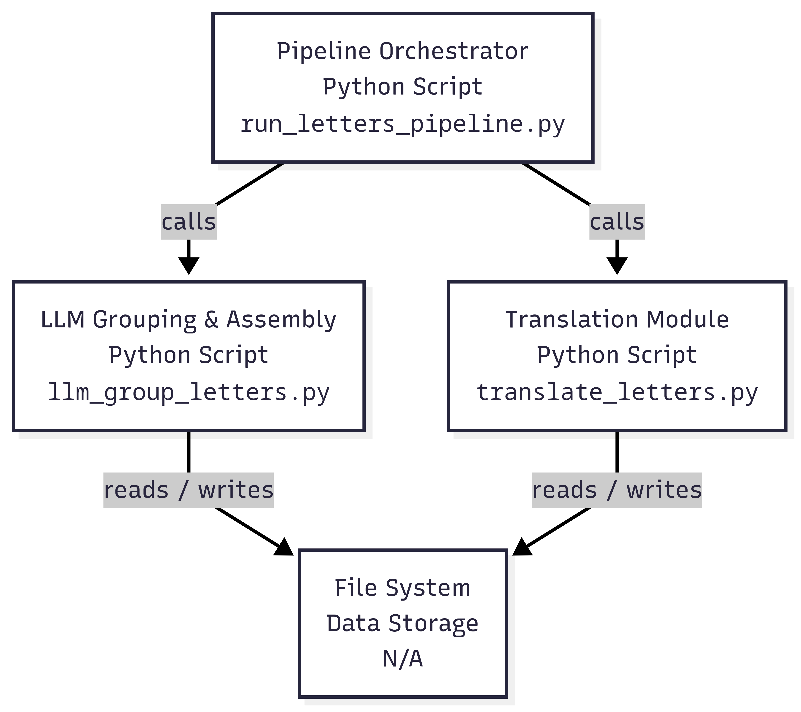

# Dorle's Stories: A Digital Assistant for Historical Letters

## Part 1: What is This Project? 

This project is a tool designed to read, understand, and organize old, handwritten family letters. Imagine you have a box full of old photos of handwritten letters from a relative named Dorle. They are written in German, the pages are all mixed up, and the handwriting is hard to read.

The Dorle's Stories project acts like a helpful digital assistant. You give it the photos of the letters, and it carefully:

1.  **Reads the handwriting** and turns it into digital text.
2.  **Sorts the mixed-up pages** into complete, individual letters.
3.  **Translates** each letter from German into English.
4.  **Produces clean, typed documents** for you to read, share, or print.

The final result is a perfectly organized digital library of your family's history, preserving the original stories for future generations.

## Part 2: How It Works, From Photo to Complete Translations

The process works in a series of intelligent steps, much like a puzzle being put together.

**Step 1: Reading the Handwriting (OCR)**
First, we show the computer's "eyes"—a technology called Optical Character Recognition (OCR)—each photo. The AI is trained to read historical German script, so it carefully transcribes the handwriting from the image into a plain text file. We do this for every single page.

**Step 2: Sorting the Pages into Letters (Semantic Grouping)**
This is the most important step. After Step 1, we have a collection of digital text files, but they are still out of order.

To solve this, we give all of the transcribed text to a powerful AI (Google's Gemini model). The AI reads through the content of all the pages at once. By understanding the topics, names, and events mentioned, it intelligently figures out which pages belong together to form a complete letter. It looks for the start of a story, how it continues, and where it ends. This is called "semantic grouping" because it groups the pages based on the *meaning* of the words, not just unreliable file dates.

**Step 3: Translation and Final Document Creation**
Once the pages are correctly grouped into letters, the AI assistant takes each complete German letter and translates it into English. Finally, it saves both the German and English versions as clean text files. It can also create professional-looking documents (using a system called LaTeX) that are ready to be turned into PDFs.

## Part 3: Why It Works This Way

You might wonder why we use a complex AI to sort the pages instead of just looking at the date on the photos.

The reason is that **metadata like file dates is often wrong**. Photos can be scanned out of order, or the camera might have had the wrong date set. If we relied on that information, we could easily mix up the pages and break a single letter into confusing, incomplete pieces.

This project's method is more reliable because it **reads the story, just like a human would**. By understanding the context, it can tell that the page talking about a "trip to the mountains" should come after the page that "plans the trip," regardless of the photo's timestamp.

This focus on the content ensures that the final, reconstructed letters are accurate and that the original narrative is preserved exactly as it was written.

## Part 4: Technical Overview

This section provides the necessary technical details to run the pipeline.



*This diagram illustrates the automated workflow of the Dorle's Stories project. It begins with the input of handwritten letter images, which are then processed through a series of steps including Optical Character Recognition (OCR) to extract text, AI-powered semantic grouping to sort pages into letters, and finally, translation from German to English. The output is a set of organized, translated, and formatted documents, available as plain text, LaTeX files, and PDFs.*

### Prerequisites

-   Python 3.10 or newer.
-   All required Python packages, which can be installed by running: `pip install -r requirements.txt`.
-   A Google Gemini API key. This key must be made available to the scripts as an environment variable named `GEMINI_API_KEY`.

**Setting the API Key in PowerShell:**
```powershell
# This command sets the key for your current terminal session
$env:GEMINI_API_KEY="your-api-key-here"
```
Alternatively, you can create a file named `.env` in the project's root directory and place your key inside it like this: `GEMINI_API_KEY=your-api-key-here`.

### How to Run the Pipeline

The easiest way to process a collection of letters is to use the main wrapper script. This single command runs all the necessary steps in the correct order.

**Example Command:**
To process all the letters in the `DorleLettersF` folder, open your terminal and run:
```bash
python run_letters_pipeline.py --base DorleLettersF
```

This command will automatically find the images, run the OCR, group the pages into letters, and translate them into English.

**Useful Options:**
-   `--no-latex`: Use this if you only want the plain text (`.txt`) English translation and do not need the formatted LaTeX (`.tex`) files.
-   `--force-translate`: Use this to re-run the translation step, even on letters that have already been translated.

### Understanding the Output Files

After the process runs, you will find the results in a `letters` sub-folder (e.g., `DorleLettersF/letters/`). Here is what the key files mean:

-   `llm_grouping.json`: This is an important manifest file. It contains the AI's decisions about how the pages were grouped. For each letter, it lists the exact source image files that belong to it, which provides a clear record of the process.
-   `L0001/de.txt`: The full, combined German text for the first letter.
-   `L0001/en.txt`: The English translation of the first letter.
-   `L0001/en.tex`: The formatted LaTeX version of the English translation, ready for creating a PDF.

### Build PDFs from LaTeX

You can compile every `en.tex` into a PDF named like the letter folder (e.g., `DorleLettersE L0001.pdf`) using the helper script `build_pdfs.py`.

Prerequisites
- Install a LaTeX engine. Options:
  - Tectonic (recommended): `winget install Tectonic.Tectonic` or `choco install tectonic`
  - MiKTeX (pdflatex/xelatex) also works if already on PATH.

Usage
- All sets A–M with cleanup: `python build_pdfs.py --glob "DorleLetters[A-M]" --engine pdflatex --cleanup`
- Better Unicode support: `python build_pdfs.py --glob "DorleLetters[A-M]" --engine xelatex --cleanup`
- Auto-detect engine: `python build_pdfs.py --glob "DorleLetters[A-M]"`
- Dry run: `python build_pdfs.py --glob "DorleLetters[A-M]" --dry-run`

Details
- The script scans `DorleLetters*/letters/*/en.tex`, compiles in each folder, then renames `en.pdf` to `<folder>.pdf` beside the `.tex`.
- If you encounter a LaTeX Unicode error (e.g., block-drawing characters) with `pdflatex`, use `--engine xelatex`.

### Appendix: Legacy and Advanced Information

For advanced users or for historical context, this repository also contains older scripts (`helperPython/ImageTranslator.py`) and alternative workflows (`helperPython/codex/`). These are not part of the main, recommended pipeline and can be disregarded for standard use. Advanced users can also run the individual pipeline scripts (`llm_group_letters.py`, `translate_letters.py`) manually if they need more granular control over each step.
